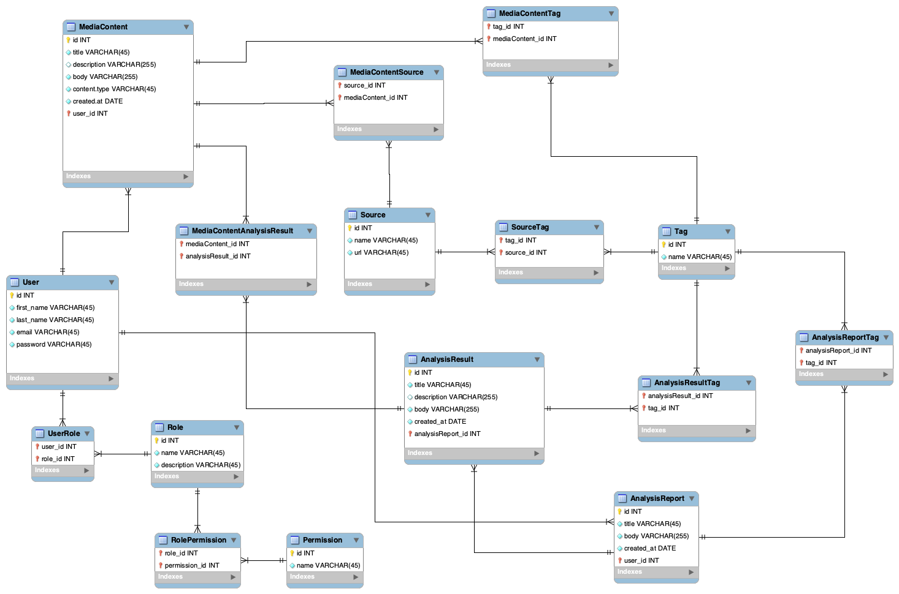

# Проєктування бази даних

## Модель бізнес-об'єктів

@startuml

left to right direction

entity User <<ENTITY>> #900020
entity User.id <<NUMBER>> #C41E3A
entity User.first_name <<TEXT>> #C41E3A
entity User.last_name <<TEXT>> #C41E3A
entity User.email <<TEXT>> #C41E3A
entity User.password <<TEXT>> #C41E3A

User.id --* User
User.first_name --* User
User.last_name --* User
User.email --* User
User.password --* User

entity MediaContent <<ENTITY>> #990099
entity MediaContent.id <<NUMBER>> #CC00CC
entity MediaContent.title <<TEXT>> #CC00CC
entity MediaContent.description <<TEXT>> #CC00CC
entity MediaContent.body <<TEXT>> #CC00CC
entity MediaContent.content_type <<TEXT>> #CC00CC
entity MediaContent.created_at <<DATE>> #CC00CC

MediaContent.id --* MediaContent
MediaContent.title --* MediaContent
MediaContent.description --* MediaContent
MediaContent.body --* MediaContent
MediaContent.content_type --* MediaContent
MediaContent.created_at --* MediaContent

entity Role <<ENTITY>> #FFFF00
entity Role.id <<NUMBER>> #FFFF66
entity Role.name <<TEXT>> #FFFF66
entity Role.description <<TEXT>> #FFFF66

Role.id --* Role
Role.name --* Role
Role.description --* Role

entity Permission <<ENTITY>> #606060
entity Permission.id <<NUMBER>> #A0A0A0
entity Permission.name <<TEXT>> #A0A0A0

Permission.id --* Permission
Permission.name --* Permission

entity Source <<ENTITY>> #FF6500
entity Source.id <<NUMBER>> #FFBD73
entity Source.name <<TEXT>> #FFBD73
entity Source.url <<TEXT>> #FFBD73

Source.id --* Source 
Source.name --* Source 
Source.url --* Source

entity AnalysisResult <<ENTITY>> #80FF00
entity AnalysisResult.id <<NUMBER>> #B2FF66
entity AnalysisResult.created_at <<DATE>> #B2FF66
entity AnalysisResult.title <<TEXT>> #B2FF66
entity AnalysisResult.description <<TEXT>> #B2FF66
entity AnalysisResult.body <<TEXT>> #B2FF66

AnalysisResult.id --* AnalysisResult
AnalysisResult.created_at --* AnalysisResult
AnalysisResult.title --* AnalysisResult
AnalysisResult.description --* AnalysisResult
AnalysisResult.body --* AnalysisResult

entity AnalysisReport <<ENTITY>> #FF00FF
entity AnalysisReport.id <<NUMBER>> #FF66FF
entity AnalysisReport.created_at <<DATE>> #FF66FF
entity AnalysisReport.title <<TEXT>> #FF66FF
entity AnalysisReport.body <<TEXT>> #FF66FF

AnalysisReport.id --* AnalysisReport
AnalysisReport.created_at --* AnalysisReport
AnalysisReport.title --* AnalysisReport
AnalysisReport.body --* AnalysisReport

entity Tag <<ENTITY>> #08C2FF 
entity Tag.name <<TEXT>> #BCF2F6 
entity Tag.id <<NUMBER>> #BCF2F6

Tag.id --* Tag 
Tag.name --* Tag

entity UserRole <<ENTITY>>

entity RolePermission <<ENTITY>>

entity MediaContentSource <<ENTITY>>

entity MediaContentAnalysisResult <<ENTITY>>

entity MediaContentTag <<ENTITY>>

entity AnalysisResultTag <<ENTITY>>

entity AnalysisReportTag <<ENTITY>>

entity SourceTag <<ENTITY>>

User "1.1" -- "0.*" MediaContent
User "1.1" -- "0.*" AnalysisResult
User "1.1" -- "0.*" AnalysisReport

User "1.1" -- "0.*" UserRole
UserRole "0.*" -- "1.1" Role

Role "1.1" -- "0.*" RolePermission
RolePermission "0.*" -- "1.1" Permission

MediaContent "1.1" -l- "0.*" MediaContentSource
MediaContentSource "0.*" -- "1.1" Source

MediaContent "1.1" -- "0.*" MediaContentAnalysisResult
MediaContentAnalysisResult "0.*" -- "1.1" AnalysisResult

MediaContent "1.1" -- "0.*" MediaContentTag
MediaContentTag "0.*" -- "1.1" Tag

AnalysisResult "1.1" -- "0.*" AnalysisResultTag
AnalysisResultTag "0.*" -- "1.1" Tag

AnalysisResult "1.*" -- "1.1" AnalysisReport

AnalysisReport "1.1" -- "0.*" AnalysisReportTag
AnalysisReportTag "0.*" -- "1.1" Tag

Source "1.1" -- "0.*" SourceTag
SourceTag "0.*" -- "1.1" Tag

@enduml

## ER-модель

@startuml
entity User {
    +id: Int
    +first_name: Text
    +last_name: Text
    +email: Text
    +password: Text
}

entity Role {
    +id: Int
    +name: Text
    +description: Text
}

entity Permission {
    +id: Int
    +name: Text
}

entity MediaContent {
  +id : Int
  +title : Text
  +description : Text
  +body : Text
  +content_type : Text
  +created_at : Date
  +user_id : Int
}

entity Source {
    +id: Int
    +name: Text
    +url: Text
}

entity Tag {
    +id: Int
    +name: Text
}

entity AnalysisResult {
    +id: Int
    +created_at: Date
    +title: Text
    +description: Text
    +body: Text
    +analysisReport_id: Int
}

entity AnalysisReport {
    +id: Int
    +title: Text
    +body: Text
    +created_at: Date
    +user_id: Int
}

entity MediaContentSource {
    source_id: Int
    mediaContent_id: Int
}

entity MediaContentTag {
    tag_id: Int
    mediaContent_id: Int
}

entity MediaContentAnalysisResult {
    mediaContent_id: Int
    analysisResult_id: Int
}

entity RolePermission {
    role_id: Int
    permission_id: Int
}

entity AnalysisResultTag {
    analysisResult_id: Int
    tag_id: Int
}

entity SourceTag{
    tag_id: Int
    source_id: Int
}

entity UserRole {
    user_id: Int
    role_id: Int
}

entity AnalysisReportTag {
    analysisReport_id: Int
    tag_id: Int
}

User ||--o{ UserRole
User ||--o{ MediaContent
User ||--o{ AnalysisResult
User ||--o{ AnalysisReport
UserRole }o--|| Role
Role ||--o{ RolePermission 
RolePermission }o--|| Permission 
MediaContent ||--o{ MediaContentTag
MediaContent ||--o{ MediaContentSource 
MediaContent ||--o{ MediaContentAnalysisResult
MediaContentAnalysisResult }o--|| AnalysisResult 
AnalysisResult ||--o{ AnalysisResultTag
AnalysisResult }|--|| AnalysisReport
MediaContentTag }o--|| Tag
MediaContentSource }o--|| Source
Source ||--o{ SourceTag
SourceTag }o--|| Tag
AnalysisResultTag }o--|| Tag
AnalysisReport ||--o{ AnalysisReportTag
AnalysisReportTag }o--|| Tag
@enduml

## Реляційна схема

  

