# Тестування працездатності системи

Тестування API проводилося за допомогою Postman

## POST api/users
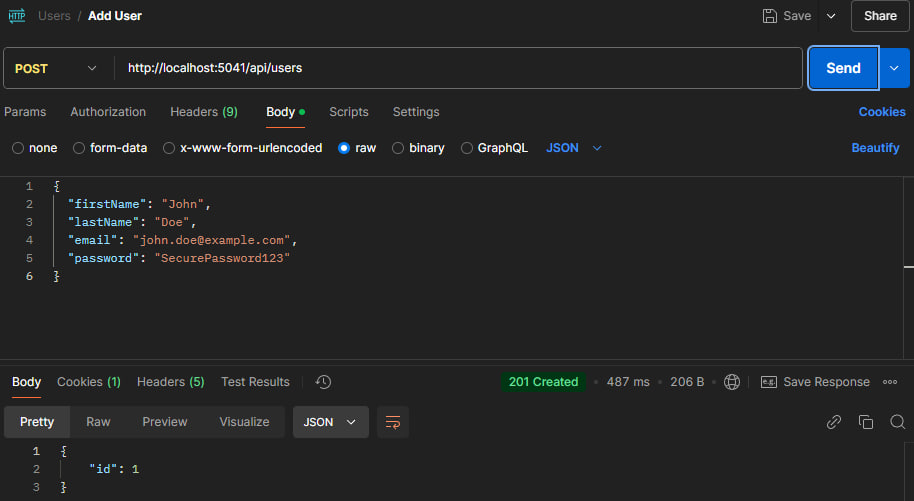
## GET api/users
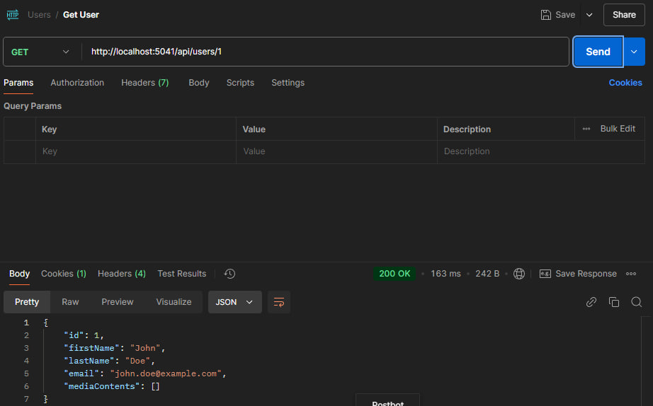
## GET api/users/:id

## PUT api/users/:id
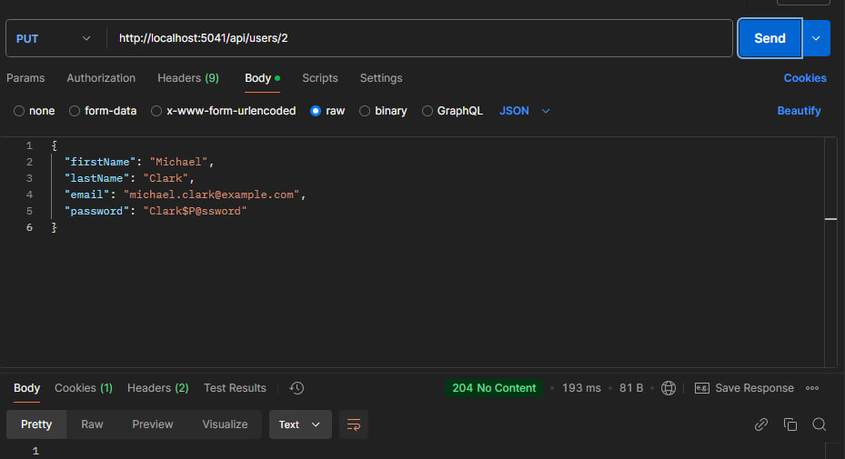
## DELETE api/users/:id
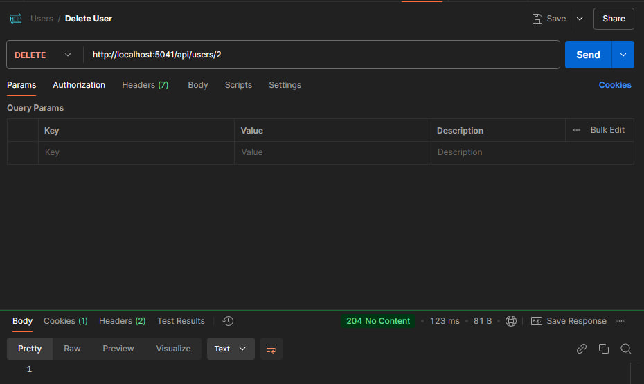
## POST api/content
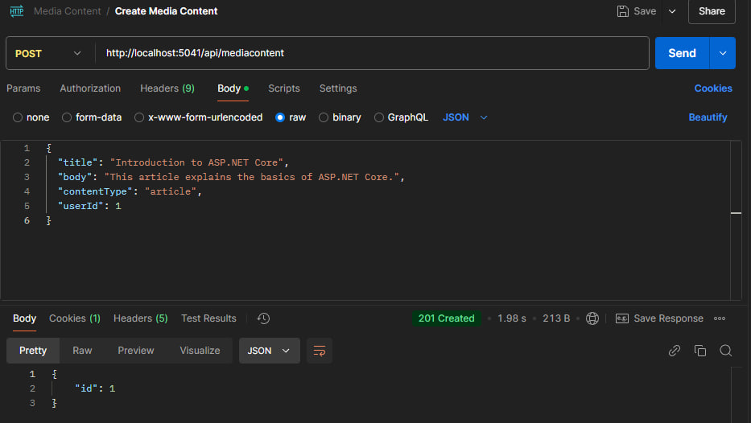
## GET api/content
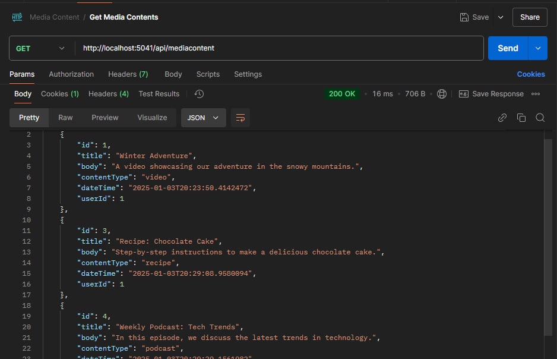
## GET api/content/:id
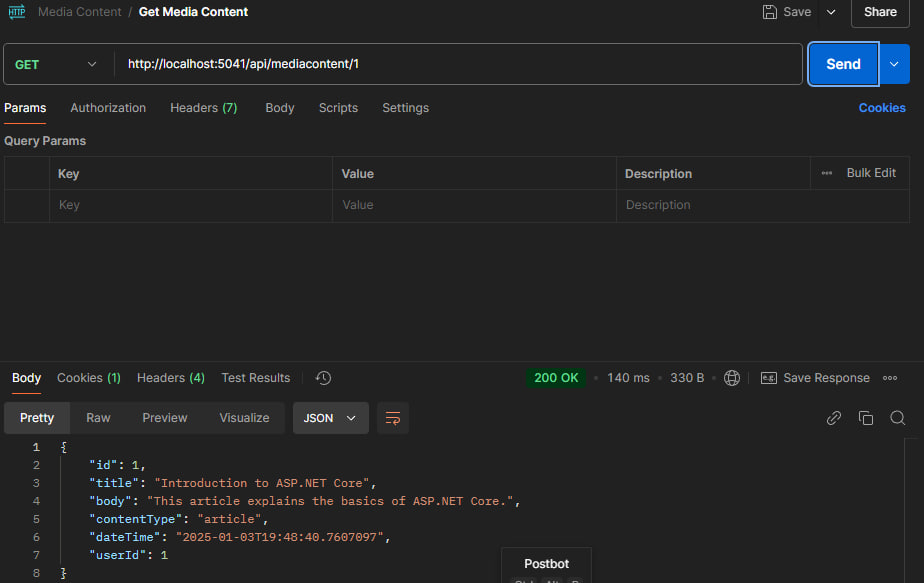
## PUT api/content/:id
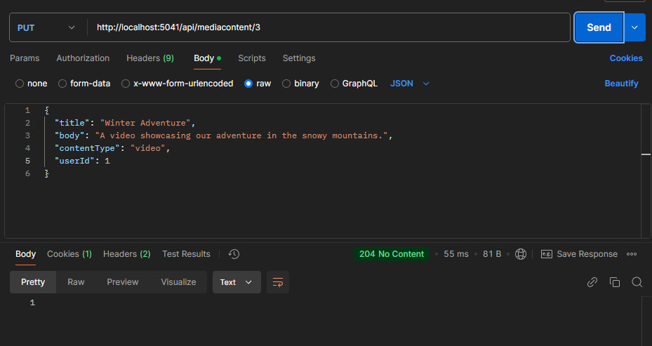
## DELETE api/content/:id
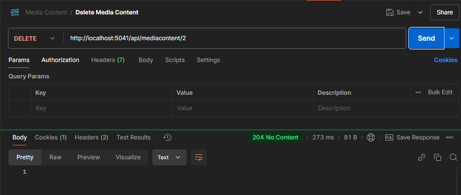
___

## EXCEPTION(User): UserNotFoundException
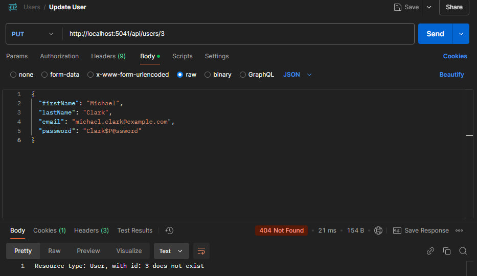
## EXCEPTION(MediaContent): RequiredFieldsMissingException
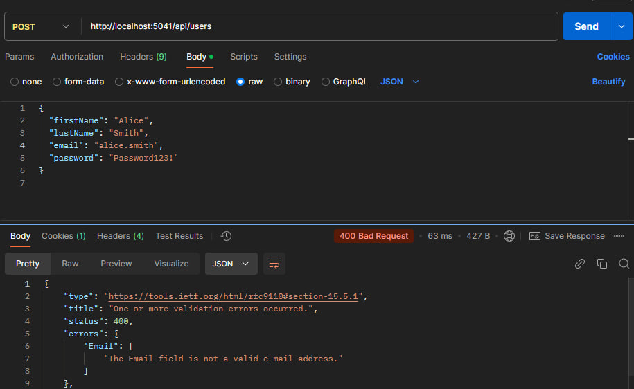
## EXCEPTION(MediaContent): MediaContentNotFoundException
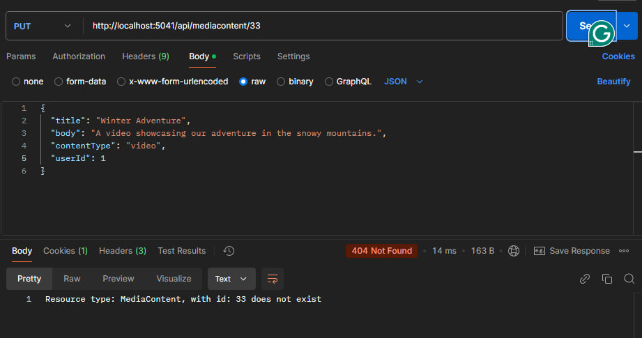
