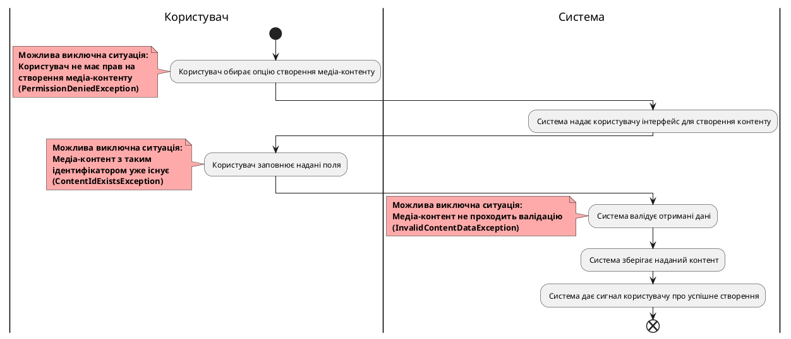

# Модель прецедентів

## 7. Сценарії використання для зареєстрованого користувача

### Створення медіа-контенту (ContentCreate)

### Пошук медіа-контенту (ContentSearch)

### Редагування інформації про медіа-контент (ContentUpdate)

### Видалення медіа-контенту (ContentDelete)

