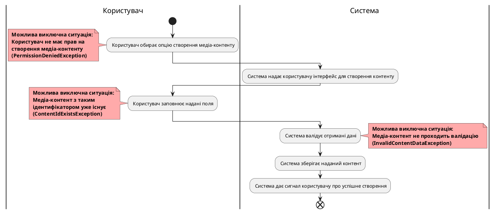
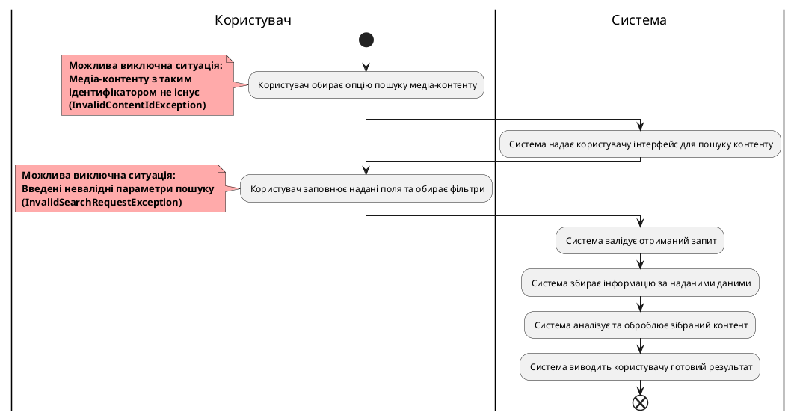

# Модель прецедентів

## Сценарії використання для зареєстрованого користувача

### Створення медіа-контенту (ContentCreate)

<b>ID:</b> UserLogin

<b>НАЗВА:</b> Авторизація користувача

<b>УЧАСНИКИ:</b> Користувач, Система

<b>ПЕРЕДУМОВИ</b> Користувач має обліковий запис у системі.

<b>РЕЗУЛЬТАТ:</b> Успішний вхід у систему.

#### ВИКЛЮЧНІ СИТУАЦІЇ
- Користувач ввів некоректні дані – `DataNotFoundException`
- Користувач не зареєстрований – `NotRegisteredException`
- Користувач перевищив кількість спроб входу – `TooManyActionsException`

#### ОСНОВНИЙ СЦЕНАРІЙ
1. Користувач відкриває сторінку входу.
2. Користувач вводить дані для авторизації.
3. Система перевіряє наявність облікового запису користувача.
4. Система перевіряє правильність введених авторизаційних даних.
5. Система надає дозвіл користувачу отримати доступ до свого облікового запису.

### Пошук медіа-контенту (ContentSearch)

<b>ID:</b>	ContentSearch

<b>НАЗВА:</b>	Пошук медіа-контенту

<b>УЧАСНИКИ:</b>	Користувач, Система

<b>ПЕРЕДУМОВИ:</b>	Користувач авторизований у системі

<b>РЕЗУЛЬТАТ:</b>	Видача користувачу результатів повного аналізу, відфільтрованого за параметрами, медіа-контенту

#### ВИКЛЮЧНІ СИТУАЦІЇ:	
- Медіа-контенту з таким ідентифікатором не існує - `InvalidContentIdException`
- Введені невалідні параметри пошуку - `InvalidSearchRequestException`

#### ОСНОВНИЙ СЦЕНАРІЙ:
1. Користувач обирає опцію пошуку медіа-контенту.
2. Система надає користувачу інтерфейс для пошуку контенту.
3. Користувач заповнює надані поля та обирає фільтри.
4. Система валідує отриманий запит.
5. Система збирає інформацію за наданими даними.
6. Система аналізує та оброблює зібраний контент.
7. Система виводить користувачу готовий результат.

### Редагування інформації про медіа-контент (ContentUpdate)

### Видалення медіа-контенту (ContentDelete)

